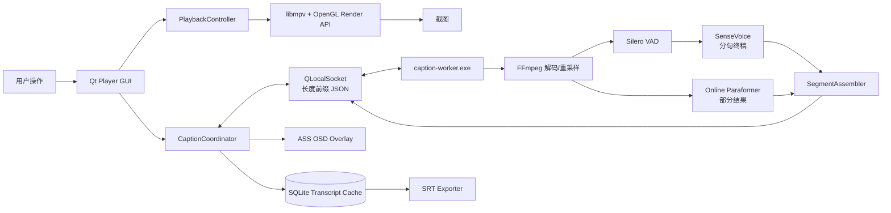
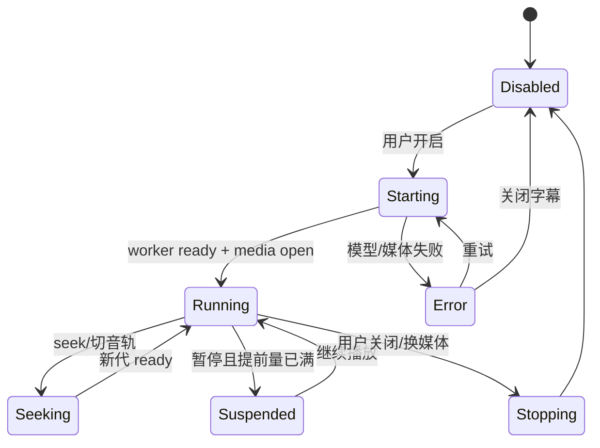

# 实时字幕播放器——详细技术实现方案

> 文档版本：v1.0  
> 基于：`实时字幕播放器 — 产品需求文档（PRD）v0.1`  
> 首发平台：Windows x64  
> 文档用途：作为开发人员、代码生成 Agent、测试 Agent、发布 Agent 的唯一工程实施基线  
> 规范词：**必须** = 不满足不得交付；**应该** = 默认执行，偏离时必须记录 ADR；**可以** = 可选增强  

---

## 0. 使用规则与交付原则

### 0.1 文档优先级

发生冲突时，按以下顺序处理：

1. PRD 决定产品目标、用户价值和功能边界。
2. 本方案决定技术实现、工程约束、接口、目录、数据结构和验收口径。
3. 《详细开发 TODO List》决定开发顺序和逐任务完成条件。
4. 自动化测试与验收用例决定某项工作是否真正完成。

任何开发 Agent 不得仅凭经验改技术路线。确需变化时，必须新增 `docs/adr/ADR-xxxx-*.md`，记录背景、备选项、决定、影响和回滚方法。

### 0.2 完成定义

一项功能只有同时满足以下条件才算完成：

- 没有占位实现、空函数、假数据、临时绕过或未说明的 `TODO/FIXME`；
- 正常流程、失败流程、取消流程、重复操作均可用；
- 有对应自动化测试，或有明确、可复现的人工验收步骤；
- 日志不泄露隐私数据；错误能转化为用户可理解的提示；
- Debug 与 Release 均能构建；安装包内的依赖、模型和许可证完整；
- 本任务涉及的文档、配置、数据库迁移和测试夹具同步更新。

### 0.3 本方案已作出的硬性决定

| 决策项 | MVP 决定 | 原因 |
|---|---|---|
| UI 技术 | C++20 + Qt 6 Widgets | Windows 优先，同时保留 macOS 复用能力；比 WinUI + SwiftUI 双壳更适合首版 |
| 播放内核 | libmpv | 满足格式、字幕、硬件解码、HDR、倍速和渲染需求 |
| 字幕进程 | 独立 `caption-worker.exe` | ASR 崩溃、模型加载、CPU 峰值不得拖垮播放器 UI |
| 音频来源 | worker 使用 FFmpeg 再次打开当前媒体并解码指定音轨 | libmpv 不提供稳定、简单的 PCM 导出接口；独立解码便于 seek、预识别和测试 |
| 实时识别 | 在线 Paraformer 负责灰色部分结果；SenseVoice 负责分句后的白色终稿 | SenseVoice 属于分段/模拟流式路线，不把它误当成原生在线 partial 模型 |
| 网盘缓存 | rclone 必须使用 `--vfs-cache-mode full` | `writes` 主要缓存写入，不能保证只读视频的读缓存；视频随机 seek 和双进程读文件需要 `full` |
| 默认播放器 | 注册能力并打开 Windows“默认应用”设置页，由用户确认 | 不修改受保护的 `UserChoice`，不伪造“一键强制设为默认” |
| 缓存清理 | MVP 不提供“直接清空 rclone VFS 缓存”按钮 | 没有通用、安全的热清理接口；直接删活动缓存可能破坏正在播放的文件 |
| 分发许可 | MVP 整体采用 GPL-3.0-or-later 开源分发 | 使用 libmpv 时先选择最保守、可执行的合规路线；闭源路线必须先替换播放内核 |
| 云端 ASR | 不进入 MVP | MVP 必须在断网状态完整工作 |
| 说话人分离 | 不进入 MVP，界面不展示假开关 | 降低首版延迟、模型体积和复杂度 |
| macOS | 只保证核心层不写死 Windows；正式版本进入后续迭代 | PRD 明确 Windows 为首要交付 |

> 以上是对 PRD 的工程化收敛，不改变“本地播放、准确中文实时字幕、离线、可导出 SRT”的产品核心。

---

## 1. 范围冻结

### 1.1 MVP 必须交付

1. Windows x64 桌面播放器，可打开本地文件、UNC 路径和 rclone 挂载盘文件。
2. 支持 `.mp4 .mkv .avi .mov .flv .ts .m2ts .webm .wmv .mpg .mpeg .m4v .ogv`。
3. 播放、暂停、停止、进度拖拽、前后帧、AB 循环、音量、静音、全屏。
4. 0.5x–4.0x 倍速，步进 0.1x，默认保音调。
5. 音轨、内嵌字幕轨选择；外挂 SRT/ASS/SSA/VTT；字幕延迟、字号、位置和编码设置。
6. 亮度、对比度、饱和度、旋转、宽高比、硬件解码和 HDR 色调映射入口；具体执行委托给 mpv。
7. 截图：纯画面截图和包含当前字幕/实时字幕的截图。
8. 播放列表、文件夹连续播放、最近播放、播放位置恢复。
9. 可自定义快捷键，并提供“恢复默认”。
10. 本地实时字幕：中文优先，支持中文/英文/自动；灰色部分结果、白色终稿。
11. 实时字幕随播放、暂停、seek、倍速、音轨切换正确同步。
12. SRT 导出，UTF-8，时间不重叠，可重复导出且结果确定。
13. 离线安装包包含默认模型；断网启动和识别完全可用。
14. 文件关联注册；“设为默认播放器”按钮打开本应用专属默认应用设置页。
15. rclone 挂载诊断与配置说明；播放器自身不重复实现视频下载缓存。
16. 崩溃日志、运行日志、可复制诊断信息；不默认采集遥测。

### 1.2 MVP 明确不做

- 云端 ASR、登录、账号、同步、付费、广告；
- 说话人分离、翻译、双语字幕、字幕编辑器；
- GPU ASR、NPU ASR；
- macOS 安装包；
- rclone 挂载管理器或网盘账号管理；
- 自动删除 rclone 活动缓存；
- 插件系统、Lua 脚本市场；
- 音频均衡器；
- DRM、受版权保护的流媒体地址解析；
- 对平台字幕准确率作未经内部语料验证的固定百分比承诺。

### 1.3 后续版本保留接口

- `IRecognizerBackend`：云 ASR、方言模型、GPU 后端；
- `IVideoSurface`：macOS Metal 或其他渲染后端；
- `IDiarizationBackend`：说话人分离；
- `ITranscriptExporter`：TXT、VTT、ASS、Markdown；
- `IPlatformIntegration`：macOS 文件关联、Dock、系统媒体键；
- `IModelSource`：离线包、用户手动导入、在线更新。

---

## 2. 可验收的质量目标

以下是工程门槛，不是宣传文案。所有数据必须在 `docs/benchmarks/` 中保留测试机器、素材、参数和原始结果。

| 类别 | MVP 门槛 |
|---|---|
| UI 响应 | GUI 线程不得出现超过 100 ms 的可重复阻塞；模型加载、数据库写入、音频解码均不在 GUI 线程 |
| 启动 | 参考机器暖启动到主窗口可交互不超过 2.5 秒；模型可以后台预热 |
| 播放 | 本地 1080p H.264/H.265 播放稳定；seek 后画面恢复目标不超过 1 秒 |
| 实时字幕首屏 | 开启字幕后，连续语音场景的首个部分结果 P95 不超过 1.5 秒 |
| 终稿延迟 | VAD 判定句尾后，终稿 P95 不超过 2.5 秒；超时允许先提交降级终稿 |
| seek 同步 | seek 后旧代字幕不得再次显示；目标 3 秒内出现新位置字幕 |
| 4x 倍速 | 推荐硬件上不持续落后超过 5 秒；算力不足时必须提示并自动切 Lite，而不是静默错位 |
| 稳定性 | worker 单次崩溃时视频继续播放；自动重启最多 3 次，随后给出明确恢复操作 |
| 隐私 | 离线模式下无业务网络连接；日志默认不记录完整字幕正文和完整文件路径 |
| 导出 | 同一转写记录重复导出字节级一致；所有时间段合法、单调、不重叠 |
| 安装 | 全新安装、覆盖升级、卸载、文件关联、中文路径、无管理员用户均有验收记录 |
| 准确率 | 建立自有合规语料后：清晰普通话 CER 目标 ≤8%，课程录音目标 ≤12%；同时相对项目内 whisper.cpp 基线至少改善 25% |

推荐硬件定义：4 个物理 CPU 核心、16 GB 内存、SSD。最低硬件：4 个逻辑核心、8 GB 内存；最低硬件默认使用 Lite 模型档位。

---

## 3. 技术栈与版本锁定

### 3.1 首次落库的参考版本

| 组件 | 锁定基线 | 用途 | 许可证处理 |
|---|---:|---|---|
| C++ | C++20 | 全部原生代码 | 项目 GPL-3.0-or-later |
| Qt | 6.11.2 | Widgets、OpenGL、Network/Local IPC、SQL、Test | 动态链接；保留 LGPLv3 文本与重链接说明 |
| CMake | 4.4.3 | 构建、测试、打包编排 | 仅构建工具 |
| mpv/libmpv | 0.41.0 | 解码、渲染、字幕轨、音轨、滤镜、倍速 | 整体按 GPL 路线发布 |
| FFmpeg | 9.0.1 | worker 直接打开媒体、解码与重采样 | 记录完整 configure flags 和库许可证 |
| sherpa-onnx | 1.13.6 | VAD、在线 Paraformer、SenseVoice、标点 | Apache-2.0，保留 NOTICE |
| SQLite | Qt SQL SQLite 驱动随 Qt 固定 | 历史、字幕片段、会话缓存 | 随 Qt 依赖清单记录 |
| WiX Toolset | 7.0.0 | Windows MSI | 仅打包工具 |
| QtTest | 随 Qt | 单元、集成测试 | 随 Qt |

版本号只作为首个可复现基线。仓库中必须增加 `dependencies.lock.json`，每项记录：

```json
{
  "schema_version": 1,
  "dependencies": [
    {
      "name": "mpv",
      "version": "0.41.0",
      "source_tag": "v0.41.0",
      "commit": "<完整提交哈希>",
      "source_archive_sha256": "<sha256>",
      "binary_artifact_sha256": "<sha256>",
      "license": "GPL-2.0-or-later/GPL-3.0-or-later build; see build log",
      "build_flags_file": "third_party/build-metadata/mpv.txt"
    }
  ]
}
```

禁止在 CI 中下载“latest”；禁止从不受控镜像随机获取 DLL；依赖升级必须由单独 PR 完成并跑完整回归。

### 3.2 编译器与构建参数

- 编译器：Visual Studio 2022 最新稳定 MSVC 工具集；Windows SDK 使用 CI 镜像内锁定版本。
- 所有目标启用：`/W4 /permissive- /Zc:__cplusplus /utf-8 /EHsc`。
- Release：启用优化、链接时优化和调试符号归档；不得删除崩溃定位所需的 PDB。
- Debug：启用运行时检查；开发机额外提供 AddressSanitizer 预设。
- 所有源文件 UTF-8；Git 强制 LF，`.bat/.cmd` 可保留 CRLF。
- 架构仅构建 x64；MVP 不提供 x86、ARM64。

### 3.3 CMake 预设

必须提供以下预设：

- `windows-msvc-debug`
- `windows-msvc-release`
- `windows-msvc-asan`
- `windows-msvc-ci`

统一命令：

```powershell
pwsh ./tools/bootstrap.ps1
cmake --preset windows-msvc-debug
cmake --build --preset windows-msvc-debug --parallel
ctest --preset windows-msvc-debug --output-on-failure

cmake --preset windows-msvc-release
cmake --build --preset windows-msvc-release --target package --parallel
```

`bootstrap.ps1` 必须幂等：重复运行不得破坏本地环境；每个下载均校验 SHA-256；失败后返回非零退出码并说明缺失项。

---

## 4. 总体架构

### 4.1 进程级架构



### 4.2 为什么播放器和字幕引擎分进程

- 模型加载、ONNX 线程和异常不会阻塞或崩溃主播放器；
- worker 可独立重启，视频仍继续播放；
- 后续替换 ASR 后端不需要改 UI/播放核心；
- 可为 worker 设置较低 CPU 优先级和独立内存监控；
- 测试可直接给 worker 输入媒体和命令，不依赖 GUI；
- 代价是同一媒体被 mpv 与 FFmpeg 各打开一次，因此 rclone 挂载必须使用 VFS `full` 读缓存。

### 4.3 主进程职责

主进程只负责：

- 生命周期、单实例、命令行、窗口；
- libmpv 创建、事件订阅、渲染与播放控制；
- UI 状态与用户输入；
- worker 启停、IPC、心跳和故障恢复；
- 当前字幕选择、叠加、时间同步；
- SQLite 持久化、播放历史、设置；
- SRT 导出、文件关联、安装后入口；
- 诊断、日志和隐私控制。

主进程不得直接运行 ASR 推理，也不得在 GUI 线程执行数据库迁移、模型校验或递归扫描文件夹。

### 4.4 worker 职责

worker 只负责：

- 验证本次启动 token 并完成 IPC 握手；
- 加载、校验和预热模型；
- 使用 FFmpeg 打开媒体并定位指定音轨；
- 解码为模型要求的单声道 PCM；
- 维护解码/识别提前量；
- VAD、部分结果、终稿、标点和片段修订；
- seek、取消、代际隔离、过载降级；
- 输出指标和结构化错误。

worker 不直接访问 SQLite、不操作 UI、不修改用户设置、不联网。

---

## 5. 仓库目录与模块边界

```text
RealtimeCaptionPlayer/
├─ CMakeLists.txt
├─ CMakePresets.json
├─ LICENSE
├─ NOTICE
├─ README.md
├─ dependencies.lock.json
├─ app/
│  ├─ player/main.cpp
│  └─ caption-worker/main.cpp
├─ src/
│  ├─ app/
│  │  ├─ Application.h/.cpp
│  │  ├─ CommandLine.h/.cpp
│  │  └─ SingleInstance.h/.cpp
│  ├─ core/
│  │  ├─ AppPaths.h/.cpp
│  │  ├─ AppVersion.h.in
│  │  ├─ Error.h/.cpp
│  │  ├─ Result.h
│  │  ├─ Timecode.h/.cpp
│  │  ├─ Cancellation.h
│  │  └─ Logging.h/.cpp
│  ├─ playback/
│  │  ├─ IMediaPlayer.h
│  │  ├─ MpvHandle.h/.cpp
│  │  ├─ MpvEventBridge.h/.cpp
│  │  ├─ MpvRenderWidget.h/.cpp
│  │  ├─ MpvPlayer.h/.cpp
│  │  ├─ TrackInfo.h
│  │  ├─ PlaybackState.h
│  │  └─ ScreenshotService.h/.cpp
│  ├─ captions/
│  │  ├─ CaptionTypes.h
│  │  ├─ CaptionCoordinator.h/.cpp
│  │  ├─ CaptionStateMachine.h/.cpp
│  │  ├─ CaptionTimeline.h/.cpp
│  │  ├─ LiveCaptionOverlay.h/.cpp
│  │  ├─ AssEscaper.h/.cpp
│  │  └─ SrtExporter.h/.cpp
│  ├─ ipc/
│  │  ├─ Protocol.h
│  │  ├─ FrameCodec.h/.cpp
│  │  ├─ JsonMessageCodec.h/.cpp
│  │  ├─ WorkerClient.h/.cpp
│  │  └─ WorkerSupervisor.h/.cpp
│  ├─ storage/
│  │  ├─ Database.h/.cpp
│  │  ├─ MigrationRunner.h/.cpp
│  │  ├─ TranscriptRepository.h/.cpp
│  │  ├─ HistoryRepository.h/.cpp
│  │  └─ StorageWorker.h/.cpp
│  ├─ settings/
│  │  ├─ Settings.h
│  │  ├─ SettingsService.h/.cpp
│  │  ├─ KeymapService.h/.cpp
│  │  └─ SettingsMigration.h/.cpp
│  ├─ playlist/
│  │  ├─ PlaylistModel.h/.cpp
│  │  └─ FolderEnumerator.h/.cpp
│  ├─ platform/
│  │  ├─ IPlatformIntegration.h
│  │  └─ windows/
│  │     ├─ WindowsIntegration.h/.cpp
│  │     ├─ FileAssociationService.h/.cpp
│  │     ├─ DefaultAppsLauncher.h/.cpp
│  │     └─ PowerManagement.h/.cpp
│  ├─ diagnostics/
│  │  ├─ DiagnosticReport.h/.cpp
│  │  ├─ HardwareProbe.h/.cpp
│  │  └─ RcloneDiagnostics.h/.cpp
│  ├─ ui/
│  │  ├─ MainWindow.h/.cpp
│  │  ├─ PlayerControls.h/.cpp
│  │  ├─ PlaylistPanel.h/.cpp
│  │  ├─ TrackMenuBuilder.h/.cpp
│  │  ├─ CaptionStatusWidget.h/.cpp
│  │  ├─ ToastManager.h/.cpp
│  │  └─ settings/*.h/.cpp
│  └─ worker/
│     ├─ CaptionWorkerApplication.h/.cpp
│     ├─ WorkerSession.h/.cpp
│     ├─ AudioDecoder.h/.cpp
│     ├─ AudioResampler.h/.cpp
│     ├─ DecodeScheduler.h/.cpp
│     ├─ PcmChunk.h
│     ├─ BoundedQueue.h
│     ├─ ModelManifest.h/.cpp
│     ├─ ModelManager.h/.cpp
│     ├─ IRecognizerBackend.h
│     ├─ OnlineParaformerBackend.h/.cpp
│     ├─ SenseVoiceBackend.h/.cpp
│     ├─ PunctuationBackend.h/.cpp
│     ├─ VadSegmenter.h/.cpp
│     ├─ SegmentAssembler.h/.cpp
│     └─ WorkerMetrics.h/.cpp
├─ resources/
│  ├─ icons/
│  ├─ translations/
│  ├─ defaults/settings.json
│  ├─ defaults/keymap.json
│  └─ models/model-bundles.json
├─ migrations/
│  ├─ 001_initial.sql
│  └─ 002_*.sql
├─ packaging/
│  ├─ wix/
│  ├─ licenses/
│  └─ third-party-notices/
├─ third_party/
│  └─ build-metadata/
├─ tools/
│  ├─ bootstrap.ps1
│  ├─ build-third-party.ps1
│  ├─ verify-models.ps1
│  ├─ run-e2e.ps1
│  ├─ package.ps1
│  └─ collect-diagnostics.ps1
├─ tests/
│  ├─ unit/
│  ├─ integration/
│  ├─ e2e/
│  ├─ fixtures/
│  └─ benchmarks/
└─ docs/
   ├─ adr/
   ├─ architecture/
   ├─ benchmarks/
   ├─ test-plans/
   ├─ release/
   └─ implementation-status.md
```

### 5.1 依赖方向

- `ui` 可以依赖 `playback/captions/settings/playlist` 的接口，不得依赖 worker 内部实现。
- `worker` 不得依赖 `ui/playback/storage/platform`。
- `core` 不依赖任何业务模块。
- `storage` 只保存领域对象，不直接引用 QWidget。
- Windows API 只能出现在 `platform/windows` 和极少量有 ADR 的构建适配层。
- 所有跨进程字段先定义在 `ipc/Protocol.h`，禁止在两端复制匿名 JSON 键名。

---

## 6. 主进程详细设计

### 6.1 Application 启动顺序

`Application::initialize()` 必须严格按以下顺序执行：

1. 解析命令行，拒绝未知危险参数；
2. 初始化 `AppPaths`，创建日志、数据库、缓存、崩溃目录；
3. 初始化日志，记录版本、操作系统、匿名硬件摘要；
4. 建立单实例锁；若已有实例，将文件参数转发后退出；
5. 加载并迁移设置；损坏时备份原文件并回到默认值；
6. 打开数据库，在 storage 线程执行迁移；
7. 创建主窗口与 `MpvPlayer`；
8. 启动 `WorkerSupervisor`，但不阻塞窗口显示；
9. 处理命令行媒体文件；
10. 启动延迟任务：模型完整性检查、硬件基准状态读取、更新提醒检查（MVP 默认无联网检查）。

任何一步失败都返回结构化 `AppError`。若数据库或字幕 worker 失败，基础播放器仍应进入“降级可播放”状态。

### 6.2 libmpv 生命周期

`MpvHandle` 是唯一持有 `mpv_handle*` 的 RAII 类型：

```cpp
class MpvHandle final {
public:
    static Result<std::unique_ptr<MpvHandle>> create();
    ~MpvHandle();
    mpv_handle* get() const noexcept;
    MpvHandle(const MpvHandle&) = delete;
    MpvHandle& operator=(const MpvHandle&) = delete;
};
```

初始化前设置：

- `terminal=no`
- `input-default-bindings=no`
- `input-vo-keyboard=no`
- `osc=no`
- `keep-open=yes`
- `idle=yes`
- `hwdec=auto-safe`
- `audio-pitch-correction=yes`
- `sub-auto=fuzzy`
- `screenshot-format=png`

随后调用 `mpv_initialize`。任何参数失败均记录参数名和错误码，但日志不得包含完整媒体路径。

### 6.3 Qt 与 mpv 事件桥

- 使用 `mpv_set_wakeup_callback`；回调中只能调用线程安全的 Qt 排队唤醒，不处理事件。
- GUI 线程中的 `MpvEventBridge::drainEvents()` 循环调用 `mpv_wait_event(handle, 0)`，直到 `MPV_EVENT_NONE`。
- 属性变更统一转为强类型 Qt signal，不允许 UI 自己解析 mpv 原始结构。
- 使用 `mpv_command_async` 执行会触发 I/O 或耗时的命令；reply userdata 由 `PendingCommandRegistry` 追踪。
- `MPV_EVENT_SHUTDOWN`、文件加载失败、轨道变化、播放结束必须有单独处理。

必须观察的属性：

- `time-pos`、`duration`、`pause`、`speed`、`idle-active`；
- `volume`、`mute`；
- `aid`、`sid`、`track-list`；
- `seeking`、`playback-abort`、`eof-reached`；
- `video-params`、`audio-params`；
- `chapter-list`（可读取但 MVP 不做复杂章节 UI）。

### 6.4 OpenGL 渲染

`MpvRenderWidget` 继承 `QOpenGLWidget`：

- `initializeGL()` 创建 `mpv_render_context`；
- `paintGL()` 调用 `mpv_render_context_render`；
- mpv render update callback 只调用 `QMetaObject::invokeMethod(widget, "update", QueuedConnection)`；
- 高 DPI 下传入实际 framebuffer 尺寸，而不是逻辑像素；
- resize、全屏、多显示器切换后验证 viewport；
- 释放顺序必须是 render context → mpv handle → OpenGL widget；
- 系统休眠、显卡驱动重置后可重建 render context，失败时显示可恢复错误页。

### 6.5 IMediaPlayer 接口

```cpp
class IMediaPlayer : public QObject {
    Q_OBJECT
public:
    virtual void open(const QUrl& url, OpenMode mode) = 0;
    virtual void play() = 0;
    virtual void pause() = 0;
    virtual void togglePause() = 0;
    virtual void seekAbsolute(std::chrono::milliseconds pos) = 0;
    virtual void seekRelative(std::chrono::milliseconds delta) = 0;
    virtual void setSpeed(double value) = 0;
    virtual void setVolume(double value) = 0;
    virtual void selectAudioTrack(std::optional<int64_t> mpvTrackId) = 0;
    virtual void selectSubtitleTrack(std::optional<int64_t> mpvTrackId) = 0;
    virtual PlaybackSnapshot snapshot() const = 0;
};
```

UI 只能调用此接口。`MpvPlayer` 负责参数校验：speed 限制为 `[0.5, 4.0]`，volume 限制为产品定义范围，seek 限制在 `[0, duration]`。

### 6.6 音轨映射

worker 必须使用与 mpv 当前播放一致的 FFmpeg stream：

1. 从 `track-list` 找到 `type=audio` 且 `id==aid` 的条目；
2. 读取该条目的 `ff-index`，保存为 `audio_ff_index`；
3. 同时保存语言、标题、codec、channels 作为诊断字段；
4. 将 `audio_ff_index` 发给 worker；
5. worker 在 FFmpeg `AVFormatContext::streams` 中按 index 校验为音频流；
6. 若 index 不存在，返回 `ASR-AUDIO-STREAM-NOT-FOUND`，主进程刷新轨道后重试一次；
7. 不允许简单使用“第一个音轨”，否则多语言 MKV 会识别错误声音。

### 6.7 播放功能映射

| 功能 | mpv 实现 |
|---|---|
| 播放/暂停 | `pause` 属性 |
| 精确 seek | `seek <seconds> absolute+exact`；拖动中节流，释放后精确定位 |
| 前进/后退 | `seek <delta> relative` |
| 下一帧/上一帧 | `frame-step` / `frame-back-step` |
| AB 循环 | `ab-loop-a`、`ab-loop-b`；第三次清除 |
| 倍速 | `speed`；确保 `audio-pitch-correction=yes`，必要时配置 `scaletempo2` |
| 外挂字幕 | `sub-add <path> select`；支持移除、重载 |
| 字幕延迟 | `sub-delay` |
| 字幕字号 | `sub-font-size` |
| 位置 | `sub-pos` |
| 画面参数 | `brightness/contrast/saturation` |
| 旋转 | `video-rotate` |
| 宽高比 | `video-aspect-override` |
| 硬解 | `hwdec=auto-safe/auto/no` |
| HDR | 使用 mpv 色彩管理与 tone mapping 属性，UI 只提供预设 |

每个映射都必须在 `tests/integration/test_mpv_commands.cpp` 中至少覆盖一次成功路径和一次无媒体路径。

### 6.8 截图

提供两个动作：

- “截图”：只保存当前视频画面，可含原视频字幕轨；
- “带当前字幕截图”：必须包含实时字幕 overlay。

首选实现：mpv `screenshot-to-file`，带字幕模式使用可包含 OSD 的截图 flag。P0 技术验证必须证明嵌入式渲染下结果包含实时字幕且不包含播放器控制栏。若该验证失败，启用后备实现：

1. `MpvRenderWidget::grabFramebuffer()` 取得视频帧；
2. 使用与 overlay 同一排版器绘制实时字幕；
3. 以 `QSaveFile` 原子写入 PNG；
4. 高 DPI、HDR 到 SDR 的颜色转换必须有样例验证。

文件名：`视频名_yyyyMMdd_HHmmss_SSS.png`。默认目录为用户图片目录；失败时弹出可复制错误，不静默丢失。

### 6.9 播放列表与历史

- 播放列表模型只保存 URL、显示名、时长、状态；不立即探测所有文件。
- 打开文件夹时后台枚举受支持扩展名；自然排序；不得阻塞 UI。
- 最近播放由 SQLite 保存，默认最多 200 条；用户可以清空。
- 播放位置每 10 秒异步保存一次，暂停、切换媒体和退出时强制保存。
- 时长少于 5 分钟或已播放至最后 30 秒的文件默认不弹“继续播放”。
- 路径不存在时历史仍可显示，但提供移除动作。

### 6.10 快捷键

快捷键由 `resources/defaults/keymap.json` 提供，用户覆盖保存到配置目录：

```json
{
  "schema_version": 1,
  "bindings": {
    "playback.toggle_pause": "Space",
    "playback.seek_backward_5s": "Left",
    "playback.seek_forward_5s": "Right",
    "playback.speed_down": "[",
    "playback.speed_up": "]",
    "caption.toggle": "Ctrl+Shift+C",
    "caption.export_srt": "Ctrl+Shift+S",
    "window.fullscreen": "F11"
  }
}
```

保存前检测冲突。系统保留键和不可解析组合必须拒绝，并在 UI 标出冲突双方。

---

## 7. 字幕 worker 与音频管线

### 7.1 worker 启动与隔离

主进程启动：

```text
caption-worker.exe
  --pipe-name <随机且仅当前用户可访问的名称>
  --session-token <256-bit 随机 token>
  --parent-pid <播放器 PID>
  --log-dir <日志目录>
```

要求：

- 不通过 shell 拼接命令；使用 `QProcess::setProgram/setArguments`；
- token 不写入普通日志；
- worker 每 2 秒发一次 heartbeat；连续 3 次丢失判为失联；
- 主进程关闭时先发 `command.shutdown`，超时后终止进程；
- worker 监控 parent PID，父进程消失后自行退出；
- 自动重启采用短退避，单次会话最多 3 次；重启后恢复当前媒体、音轨、语言、档位和 playhead。

### 7.2 IPC 帧格式

每一帧：

```text
uint32 little-endian payload_length
payload_length bytes UTF-8 JSON
```

约束：

- 最大帧 1 MiB；超过立即断开并记录 `IPC-FRAME-TOO-LARGE`；
- JSON 必须是对象；必须包含 `v/type/id/generation/payload`；
- 未知消息类型返回错误，不崩溃；
- 字符串使用 UTF-8；时间统一使用整数毫秒；
- 不发送 PCM，避免 IPC 大流量；worker 自己读取媒体；
- 每个命令都返回 `ack` 或 `error`；事件可以无请求 ID。

统一信封：

```json
{
  "v": 1,
  "type": "command.open_media",
  "id": "01J...",
  "generation": 12,
  "payload": {}
}
```

### 7.3 消息清单

主进程 → worker：

- `command.hello`
- `command.load_model_bundle`
- `command.open_media`
- `command.close_media`
- `command.set_playhead`
- `command.seek`
- `command.set_paused`
- `command.set_speed`
- `command.set_audio_track`
- `command.set_language`
- `command.set_profile`
- `command.start_captioning`
- `command.stop_captioning`
- `command.shutdown`

worker → 主进程：

- `event.ready`
- `event.model_progress`
- `event.media_opened`
- `event.caption_partial`
- `event.caption_final`
- `event.caption_revision`
- `event.coverage_progress`
- `event.overload`
- `event.metrics`
- `event.heartbeat`
- `event.error`

`caption_final` 示例：

```json
{
  "v": 1,
  "type": "event.caption_final",
  "id": "01J...",
  "generation": 12,
  "payload": {
    "session_id": "01J...",
    "segment_id": "seg-000034",
    "revision": 2,
    "start_ms": 182340,
    "end_ms": 185920,
    "text": "这里是最终识别结果。",
    "language": "zh",
    "source": "sensevoice",
    "is_final": true
  }
}
```

### 7.4 代际取消

每次以下事件发生时，`CaptionCoordinator` 将 `generation` 加一：

- 打开新媒体；
- seek；
- 切换音轨；
- 切换模型档位或语言；
- 用户关闭再重新开启实时字幕。

主进程只接受 generation 等于当前值的字幕事件。worker 收到新 generation 后：

1. 取消旧 decoder token；
2. 清空所有 PCM、VAD 和推理队列；
3. 重置在线识别流；
4. 执行 FFmpeg seek；
5. 用新 generation 重新输出。

旧任务即使稍后返回，也只能被丢弃，绝不写入当前会话。

### 7.5 FFmpeg 打开与解码

`AudioDecoder::open()`：

1. 用 UTF-8/宽字符兼容路径打开；不得经 shell；
2. `avformat_open_input`；
3. `avformat_find_stream_info`；
4. 校验 `audio_ff_index`；
5. 找到 decoder，创建 `AVCodecContext`；
6. 初始化重采样为模型要求的采样率、单声道、float32；
7. 记录 stream `time_base`、start time、duration；
8. 将容器/codec 诊断字段返回，但不把完整路径写日志。

输出 `PcmChunk`：

```cpp
struct PcmChunk {
    uint64_t generation;
    int64_t start_ms;
    int sample_rate;
    std::vector<float> samples;   // normalized [-1, 1]
    bool discontinuity;
    bool end_of_stream;
};
```

默认 chunk 为 100 ms。不得依赖 packet PTS 直接当作每个样本的时间；必须从解码帧最佳时间戳和累计样本数共同构造单调 sample clock。

### 7.6 seek 细节

收到目标 `target_ms` 后：

1. 使用 `avformat_seek_file` 定位到 `target_ms - 800 ms` 的关键帧附近；
2. `avcodec_flush_buffers`；
3. 重置 resampler、sample clock 和 VAD；
4. 解码并丢弃目标前音频，只保留用于语境的最多 300 ms pre-roll；
5. 首个输出 chunk 标记 `discontinuity=true`；
6. worker 回传 `media_opened/seek_ready`；
7. 不得把 pre-roll 文本显示为目标前字幕。

若媒体不支持 seek，返回 `ASR-MEDIA-NOT-SEEKABLE`，主进程提示“实时字幕将从当前位置之后重新开始”，基础视频仍可播放。

### 7.7 解码提前量调度

worker 以“媒体时间”而不是“墙钟时间”调度：

```text
target_lead_ms = clamp(30000 * playback_speed, 30000, 90000)
max_lead_ms    = min(target_lead_ms + 30000, 120000)
lead_ms        = decoded_until_ms - playhead_ms
```

- `lead_ms < target_lead_ms`：尽快解码和识别；
- `lead_ms > max_lead_ms`：等待 playhead 推进；
- 暂停时最多继续到 `max_lead_ms`，之后休眠；
- seek 直接丢弃旧提前量；
- 内存中 PCM 上限按时间控制，默认不超过 120 秒；
- 倍速只改变提前量目标，不改变字幕时间戳；字幕始终使用源媒体时间。

有缓存片段覆盖目标时间时，主进程先显示数据库结果，worker 从覆盖末端继续，不重复识别。

### 7.8 有界队列与线程

worker 至少包含：

- IPC/控制线程；
- Decode 线程；
- Online ASR 线程；
- Final ASR 线程（Lite 档关闭）；
- 指标汇总定时器。

队列：

| 队列 | 默认上限 | 满时策略 |
|---|---:|---|
| decoded PCM chunks | 300 个 100 ms chunk | 停止解码，绝不丢音频 |
| final speech segments | 16 段 | 暂停解码并上报 overload |
| outbound events | 1000 条 | 合并 metrics/partial；final/error 不得丢 |

`partial` 更新最多每 200 ms 发一次，相同文本不重复发。Final 结果必须按 segment 顺序提交；后到的修订通过 `revision` 覆盖，不新增重叠片段。

---

## 8. ASR 模型与识别策略

### 8.1 模型包

`resources/models/model-bundles.json`：

```json
{
  "schema_version": 1,
  "bundles": [
    {
      "id": "lite-zh-en-v1",
      "display_name": "轻量实时",
      "min_ram_mb": 8192,
      "components": {
        "online_asr": "paraformer-zh-en-int8-v1",
        "vad": "silero-vad-v1",
        "punctuation": "ct-transformer-zh-en-int8-v1"
      }
    },
    {
      "id": "balanced-multilingual-v1",
      "display_name": "均衡高精度",
      "min_ram_mb": 12288,
      "components": {
        "online_asr": "paraformer-zh-en-int8-v1",
        "vad": "silero-vad-v1",
        "punctuation": "ct-transformer-zh-en-int8-v1",
        "final_asr": "sensevoice-zh-en-ja-ko-yue-int8-2024-v1"
      }
    }
  ]
}
```

每个 component 的 manifest 必须包含：

- 文件清单、字节数、SHA-256；
- 模型类型、采样率、支持语言；
- sherpa-onnx 兼容版本范围；
- 来源、许可证、NOTICE；
- int8/fp32；
- 推荐线程数；
- 是否支持 partial、标点、语言识别、时间戳；
- 发布前基准结果。

模型损坏不得导致崩溃。校验失败后禁用实时字幕并提供“重新安装模型”提示；基础播放继续可用。

### 8.2 档位定义

#### Lite：轻量实时

链路：

```text
PCM → Online Paraformer → endpoint → punctuation → final
```

- 在线 Paraformer 每 200 ms 更新灰色 partial；
- endpoint 或 VAD 句尾后，将在线结果送入标点模型；
- 终稿来源标记为 `paraformer_punctuated`；
- 用于低内存、低算力、4x 跟不上或 SenseVoice 不可用场景；
- 模型本身若无 token 时间戳，片段时间使用音频 sample clock + VAD/endpoint 边界，不伪造词级时间戳。

#### Balanced：均衡高精度（推荐硬件默认）

链路：

```text
PCM ─┬→ Online Paraformer → partial 灰字
     └→ VAD 分句 → SenseVoice → final 白字
```

- partial 提供低延迟阅读；
- VAD 完整片段送 SenseVoice，启用 ITN/标点能力；
- final 通过相同 `segment_id` 替换 partial；
- 若 SenseVoice 在句尾后 2.5 秒仍未完成，先提交标点化 Paraformer 作为 revision 1；
- SenseVoice 后到时可提交 revision 2，数据库和导出使用最新 revision；
- 当前字幕已离开屏幕后不突然回跳，但转写记录可静默修订并在“字幕已优化”状态中计数。

### 8.3 VAD 分句参数

初始默认值：

- 最短语音：250 ms；
- 开始 padding：200 ms；
- 结束 padding：300 ms；
- 静音断句：550 ms；
- 小于 250 ms 的间隔可合并；
- 单段最大 25 秒；超长段在低能量点切分；
- 最短有效片段 400 ms；过短噪声丢弃但计入 metrics。

参数放在模型 manifest 或设置内部配置，不直接暴露所有高级项给普通用户。每次调整必须用语料集回归。

### 8.4 语言策略

- `zh`：partial 与 final 按中文优先；
- `en`：在线中英模型按英文提示，标点按英文规则；
- `auto`：Balanced 的 SenseVoice 负责最终语言判断；partial 仍使用中英在线模型；
- 日语/韩语/粤语在 MVP 仅保证 Balanced 终稿“可尝试”，界面标记“实验性”；
- 纯日语/韩语下若在线模型无法给出有效 partial，显示“正在识别…”而不是乱码；
- 不向用户承诺未进入内部测试集的方言质量。

### 8.5 片段组装规则

`SegmentAssembler` 维护每代会话的有序 timeline：

- `segment_id` 在 VAD 确定语音开始时创建；
- partial 只能更新当前开放 segment；
- final 必须有 `start_ms < end_ms`；
- 相邻 final 若间隔 <100 ms 且总长度合理，可以在导出时合并，不在原始库中丢失边界；
- 后一段开始早于前一段结束时，将前一段结束裁剪到后一段开始，最短保留 200 ms；
- 空文本、纯标点、重复文本不写库；
- 修订必须 `revision` 递增；旧 revision 保留审计字段或被事务性替换；
- 所有文本在显示前进行控制字符过滤和 ASS 转义；原始 Unicode 正文保存在数据库。

### 8.6 过载检测与自动降级

每 2 秒计算：

- 实时因子 RTF；
- `final_queue_depth`；
- `decoded_until - recognized_until`；
- worker RSS；
- 模型单段耗时 P50/P95。

触发条件：连续 10 秒 `recognized_until < playhead - 5000 ms`，或 final 队列接近上限。

处理顺序：

1. 降低 partial 刷新频率；
2. 缩短最大 ahead window；
3. Balanced 暂停 SenseVoice 新任务，使用 Lite 终稿；
4. 通知主进程显示“设备处理速度不足，已切换轻量模式”；
5. 用户可在设置中手动恢复，但同一会话不反复自动抖动切换。

绝不通过伪造时间戳、跳过整段语音或显示过时字幕来“看起来流畅”。

---

## 9. 字幕同步、显示与导出

### 9.1 CaptionCoordinator 状态机



每个状态都要定义：允许的命令、overlay 文案、是否接收字幕事件、退出动作。禁止用多个互相矛盾的布尔值替代状态机。

### 9.2 时间同步

- mpv `time-pos` 是唯一当前播放时间源；
- worker 字幕时间来自媒体音频 PTS/sample clock；
- overlay 根据 `time-pos + user_caption_delay_ms` 查询 timeline；
- speed 变化不重写任何字幕时间；
- pause 时保留当前字幕，不继续滚动；
- seek 时立即清空旧 partial，数据库已有的新位置 final 可以立即显示；
- 容许显示窗口：片段开始前 50 ms 不显示，结束后最多保留 150 ms；
- 时间不连续的媒体由 decoder 标记 discontinuity，并开始新片段。

### 9.3 Overlay 实现

首选 `MpvAssOverlayBackend`，通过 mpv `osd-overlay` 的 ASS events：

- 固定 overlay ID，更新而非不断创建；
- partial：灰色；final：白色；
- 默认底部居中，距底边 8%；
- 黑色描边与半透明背景可配置；
- 字体优先使用系统中文 UI 字体，不随安装包分发字体文件；
- 文本最多 2 行；超长按 Unicode 字符与标点智能断行；
- 过滤 ASS 控制字符并转义 `{ } \\`；
- 关闭字幕、换媒体、seek 时清空 overlay；
- 全屏、DPI、窗口宽度变化时重排。

额外维护一个不可见但可访问的 Qt 文本对象，把当前 final 字幕暴露给辅助技术；不得只在像素层显示。

### 9.4 字幕显示优先级

1. 用户主动选择的现有字幕轨；
2. 实时字幕 overlay；
3. 状态提示（如“模型加载中”）不得覆盖关键字幕区域，放在右上角状态组件。

允许同时显示原字幕轨和实时字幕，但设置中提供：

- 仅原字幕；
- 仅实时字幕；
- 两者同时显示（原字幕上移）；
- 无字幕。

### 9.5 SQLite 数据结构

`001_initial.sql`：

```sql
PRAGMA foreign_keys = ON;

CREATE TABLE schema_meta (
    version INTEGER NOT NULL
);

CREATE TABLE media (
    id INTEGER PRIMARY KEY,
    canonical_url TEXT NOT NULL,
    file_size INTEGER,
    modified_time_ms INTEGER,
    duration_ms INTEGER,
    last_position_ms INTEGER NOT NULL DEFAULT 0,
    last_played_at_ms INTEGER,
    selected_audio_ff_index INTEGER,
    created_at_ms INTEGER NOT NULL,
    updated_at_ms INTEGER NOT NULL,
    UNIQUE(canonical_url, file_size, modified_time_ms)
);

CREATE TABLE caption_session (
    id TEXT PRIMARY KEY,
    media_id INTEGER NOT NULL REFERENCES media(id) ON DELETE CASCADE,
    audio_ff_index INTEGER NOT NULL,
    model_bundle_id TEXT NOT NULL,
    model_bundle_version TEXT NOT NULL,
    language TEXT NOT NULL,
    profile TEXT NOT NULL,
    status TEXT NOT NULL,
    covered_until_ms INTEGER NOT NULL DEFAULT 0,
    created_at_ms INTEGER NOT NULL,
    updated_at_ms INTEGER NOT NULL
);

CREATE TABLE caption_segment (
    session_id TEXT NOT NULL REFERENCES caption_session(id) ON DELETE CASCADE,
    segment_id TEXT NOT NULL,
    revision INTEGER NOT NULL,
    start_ms INTEGER NOT NULL,
    end_ms INTEGER NOT NULL,
    text TEXT NOT NULL,
    language TEXT,
    source TEXT NOT NULL,
    created_at_ms INTEGER NOT NULL,
    PRIMARY KEY(session_id, segment_id),
    CHECK(start_ms >= 0),
    CHECK(end_ms > start_ms),
    CHECK(revision >= 1)
);

CREATE INDEX idx_caption_segment_time
ON caption_segment(session_id, start_ms, end_ms);

CREATE TABLE playlist (
    id TEXT PRIMARY KEY,
    name TEXT NOT NULL,
    created_at_ms INTEGER NOT NULL,
    updated_at_ms INTEGER NOT NULL
);

CREATE TABLE playlist_item (
    playlist_id TEXT NOT NULL REFERENCES playlist(id) ON DELETE CASCADE,
    position INTEGER NOT NULL,
    url TEXT NOT NULL,
    display_name TEXT,
    PRIMARY KEY(playlist_id, position)
);
```

规则：

- partial 不写数据库；
- final/revision 在 storage 线程事务写入；
- DB 使用 WAL，设置合理 busy timeout；
- 数据库损坏时先复制到 `recovery/`，新建库，不自动删除原文件；
- 每个 schema 变化都新增迁移，不修改已发布迁移；
- transcript cache key 至少包含媒体身份、音轨、模型包版本、语言、档位。

### 9.6 SRT 导出算法

输入只使用当前会话最新 final revision，按 `start_ms, segment_id` 排序：

1. 丢弃空文本；
2. 将开始/结束限制在媒体范围；
3. 若后一段开始早于前一段结束，前一段结束裁剪到后一段开始；
4. 每段最短 300 ms；过短时在不与下一段冲突的前提下延长；
5. 每条最多 2 行，建议每行不超过 20 个中文字符或 42 个拉丁字符；
6. 保留中文标点，不把字符按字节切断；
7. 时间格式 `HH:MM:SS,mmm`，小时可超过 99；
8. 输出 UTF-8 with BOM，兼容常见 Windows 播放器；
9. 用 `QSaveFile` 原子替换；
10. 文件名冲突默认询问覆盖，自动导出模式使用版本后缀。

没有任何 final 片段时禁用导出按钮并解释原因。正在识别时允许导出“当前已完成部分”，文件名增加 `_partial`，UI 明确标记。

---

## 10. 设置、路径与隐私

### 10.1 Windows 路径

```text
安装目录：%LOCALAPPDATA%\Programs\RealtimeCaptionPlayer\
配置目录：%APPDATA%\RealtimeCaptionPlayer\
数据目录：%LOCALAPPDATA%\RealtimeCaptionPlayer\data\
日志目录：%LOCALAPPDATA%\RealtimeCaptionPlayer\logs\
模型目录：%LOCALAPPDATA%\RealtimeCaptionPlayer\models\
截图默认：Known Folder Pictures\RealtimeCaptionPlayer\
导出默认：媒体同目录；不可写时用 Known Folder Videos\RealtimeCaptionPlayer\
```

所有路径通过 Known Folder/Qt API 获取，不手写用户名路径。支持空格、中文、emoji、UNC 和长路径。

### 10.2 settings.json

```json
{
  "schema_version": 1,
  "playback": {
    "hardware_decode": "auto-safe",
    "remember_position": true,
    "folder_continuous_play": true,
    "default_speed": 1.0,
    "pitch_correction": true
  },
  "captions": {
    "enabled_by_default": false,
    "profile": "auto",
    "language": "zh",
    "font_size": 38,
    "bottom_margin_percent": 8,
    "show_background": true,
    "delay_ms": 0,
    "auto_export_srt": false
  },
  "models": {
    "bundle_id": "balanced-multilingual-v1",
    "verify_on_startup": "incremental"
  },
  "privacy": {
    "allow_network": false,
    "telemetry": false,
    "log_caption_text": false,
    "log_full_paths": false
  },
  "diagnostics": {
    "log_level": "info",
    "keep_log_days": 14
  }
}
```

读取后进行 schema 验证、范围裁剪和迁移。保存使用 `QSaveFile`；失败不覆盖内存中的有效设置，并提示用户。

### 10.3 日志与诊断

- `player.log` 与 `caption-worker.log` 分开，按大小轮转，总量设上限；
- 每条日志包含 UTC 时间、进程、线程、category、level、session correlation ID；
- 默认路径只保留文件名和不可逆短 hash；
- 默认不记录字幕正文；用户主动生成诊断包时仍需二次确认；
- 诊断包包含版本、依赖锁摘要、模型 hash、设置脱敏副本、最近日志、GPU/CPU 摘要；
- 不包含媒体文件、完整字幕数据库、账号凭据或 rclone 配置中的 token。

### 10.4 网络策略

MVP 没有业务联网需求：

- 代码中不集成遥测 SDK；
- worker 不链接网络业务代码；
- 模型更新不自动联网；
- 所有默认模型随离线安装包提供；
- QA 使用系统防火墙/抓包验证断网可用和无意外外连；
- 将来新增云 ASR 必须是显式开关、独立隐私说明和独立 backend。

---

## 11. Windows 集成与安装

### 11.1 文件关联

采用 per-user 注册，避免要求管理员权限：

- ProgID：`RealtimeCaptionPlayer.Video.1`；
- 在 `HKCU\Software\Classes\RealtimeCaptionPlayer.Video.1` 注册图标和 open command；
- 在 `HKCU\Software\RegisteredApplications` 注册应用；
- 在应用 `Capabilities\FileAssociations` 声明扩展名；
- open command 必须正确引用可执行文件和 `%1`，路径全程带引号；
- 升级时保持 ProgID 稳定；破坏性关联变化才增加版本；
- 卸载只删除本应用拥有的键，不修改用户当前 `UserChoice`。

### 11.2 “设为默认播放器”按钮

按钮行为：

1. 确认文件关联能力已注册；
2. 打开 `ms-settings:defaultapps` 的本应用专属页面（使用注册应用参数）；
3. UI 展示三步引导：选择本应用 → 设置支持的文件类型 → 返回播放器；
4. 返回后可刷新检测，但不得声称所有扩展名已默认，除非系统 API/关联查询明确证明。

不得写入或破解 `UserChoice` 哈希，不得模拟用户点击系统设置。

### 11.3 单实例与文件打开

命令行：

```text
RealtimeCaptionPlayer.exe [--enqueue | --play-now] [--fullscreen] <media...>
```

- 首实例建立当前用户专属 `QLocalServer`；
- 后续实例将规范化 URL 列表发送给首实例，然后退出；
- 默认 `--play-now` 打开第一个，其余加入列表；
- 来自文件关联的路径视为不可信输入：校验存在性和支持类型，不执行文件内容；
- 同一文件重复打开时聚焦窗口，不重复创建会话。

### 11.4 安装包组成

默认发布两个构件：

1. `RealtimeCaptionPlayer-Offline-x64.msi`：应用 + Lite + Balanced 默认模型，真正离线开箱即用；
2. `RealtimeCaptionPlayer-Lite-x64.msi`：应用 + Lite 模型，面向低配或体积敏感用户。

打包顺序：

1. 构建 Release；
2. 运行单元与集成测试；
3. `windeployqt` 收集 Qt DLL/plugins；
4. 复制自建 libmpv、FFmpeg、sherpa-onnx 运行库；
5. 复制并校验模型；
6. 生成第三方许可证和 SBOM；
7. WiX/CPack 生成 MSI；
8. 安装到干净虚拟机跑 smoke test；
9. 公共发布前签名 EXE、DLL、MSI；
10. 输出 SHA-256 和 release manifest。

### 11.5 升级与卸载

- 覆盖升级保留设置、历史、数据库和用户模型；
- schema migration 必须支持从所有已发布版本逐级升级；
- 卸载默认保留用户数据，提供“同时删除用户数据”可选项；
- 正在运行时升级必须提示关闭，不能强杀后留下损坏 DB；
- 回滚测试至少覆盖“新版本 DB 已迁移后旧版本不能打开”的清晰提示，不允许旧版静默破坏数据。

---

## 12. rclone 挂载与网盘播放

### 12.1 正确配置

播放器不创建第二套缓存。对视频只读播放，推荐挂载参数：

```text
--vfs-cache-mode full
--vfs-cache-max-size 50G
--vfs-cache-max-age 1h
--vfs-read-ahead 2G
--buffer-size 32M
--cache-dir <NTFS SSD 路径>
```

约束：

- 缓存目录优先放 SSD；
- 文件系统应支持 sparse files，避免 FAT/exFAT；
- `max-size` 必须结合磁盘容量设置；
- 同一个媒体由 mpv 和 worker 打开时，`full` 模式让二者复用 VFS 磁盘缓存；
- `writes` 不作为本产品视频读缓存推荐值；
- 最大缓存和最大年龄由 rclone 自己清理，播放器只做提示。

### 12.2 RcloneDiagnostics

只做非侵入式诊断：

- 判断路径是否位于固定盘、网络盘或映射盘；
- 可选读取用户主动选择的挂载命令文本，解析是否包含 `--vfs-cache-mode full`；
- 未经用户选择不得扫描或修改所有 `.bat`；
- 检查缓存目录是否存在、可写、剩余空间是否低；
- 输出建议命令，提供复制按钮；
- 不保存 rclone 密钥、配置文件正文；
- 不自动停止挂载、不删除正在使用的缓存文件。

### 12.3 缓存清理策略

MVP 不实现热清理按钮。后续若实现，必须满足：

1. 能确认该 mount 由本应用管理；
2. 先停止对该 mount 的所有文件句柄；
3. 正常停止 rclone 进程；
4. 验证缓存目录归属；
5. 只删除该 mount 的内容缓存；
6. 重启挂载；
7. 全流程有失败回滚。

仅通过“清空某个目录”实现的按钮不允许合入。

---

## 13. 错误模型与用户提示

统一错误：

```cpp
enum class ErrorDomain { App, Playback, Caption, Model, Ipc, Storage, Export, Install, Rclone };

struct AppError {
    ErrorDomain domain;
    QString code;
    QString userMessage;
    QString technicalMessage;
    bool retryable;
    QVariantMap context; // 已脱敏
};
```

核心错误码：

| 错误码 | 用户提示 | 自动处理 |
|---|---|---|
| `PLY-OPEN-FAILED` | 无法打开该媒体文件 | 保留播放列表，允许重试/复制详情 |
| `PLY-TRACK-MISSING` | 当前音轨已不可用，请重新选择 | 刷新 track-list |
| `MOD-MISSING` | 实时字幕模型未安装完整 | 禁用字幕，播放器继续工作 |
| `MOD-HASH-MISMATCH` | 模型文件损坏 | 提供重新安装说明 |
| `IPC-WORKER-DIED` | 字幕引擎已停止，正在恢复 | 最多自动重启 3 次 |
| `IPC-PROTOCOL-MISMATCH` | 字幕组件版本不匹配 | 停止重试，提示重新安装 |
| `ASR-AUDIO-STREAM-NOT-FOUND` | 无法读取当前音轨 | 刷新并重试一次 |
| `ASR-MEDIA-NOT-SEEKABLE` | 此媒体无法从新位置继续识别 | 从可用位置继续或关闭字幕 |
| `ASR-OVERLOAD` | 设备处理速度不足，已切换轻量模式 | 自动降级一次 |
| `DB-MIGRATION-FAILED` | 历史数据暂时不可用 | 备份 DB，基础播放继续 |
| `EXP-WRITE-DENIED` | 无法写入所选位置 | 建议用户视频目录 |
| `RCLONE-CACHE-OFF` | 当前挂载未启用完整读缓存，拖动可能卡顿 | 显示配置建议，不自动修改 |

技术详情进入日志；用户界面只显示可行动的消息和“复制诊断信息”。

---

## 14. 测试体系

### 14.1 单元测试

必须覆盖：

- Timecode/SRT 格式化与 100 小时以上时长；
- ASS 转义、Unicode 换行、控制字符过滤；
- IPC 长度前缀、拆包、粘包、超大帧、坏 JSON；
- CaptionStateMachine 所有合法/非法转换；
- SegmentAssembler 重叠、修订、空文本、乱序事件；
- 设置校验、迁移、损坏恢复；
- keymap 冲突；
- 数据库迁移和事务回滚；
- rclone 参数解析；
- Windows registry 路径/命令字符串生成；
- 媒体 identity 与缓存失效；
- bounded queue 取消和关闭。

### 14.2 集成测试

- libmpv 初始化、加载 fixture、播放、暂停、seek、倍速、轨道选择；
- OpenGL render context 创建/销毁 50 次无崩溃；
- worker 启动、握手、心跳、优雅关闭；
- FFmpeg 解码不同容器/codec/采样率/多音轨；
- seek 后首个 chunk 时间正确；
- Lite partial/final；Balanced partial → SenseVoice revision；
- worker crash 自动恢复；
- SQLite final 持久化和缓存复用；
- screenshot 包含实时字幕；
- SRT golden file；
- 中文、空格、emoji、UNC、长路径。

### 14.3 E2E 测试矩阵

| 维度 | 用例 |
|---|---|
| 系统 | Windows 11 当前受支持版本；Windows 10 22H2 best-effort 兼容 |
| 显示 | 100%/150%/200% DPI；单屏/双屏；全屏切换 |
| 视频 | H.264/H.265/VP9/AV1；720p/1080p/4K；SDR/HDR 样例 |
| 容器 | MP4/MKV/AVI/MOV/TS/WebM |
| 音频 | AAC/AC3/EAC3/MP3/Opus/FLAC；16k–96k；mono/stereo/5.1 |
| 字幕 | SRT/ASS/SSA/VTT；UTF-8/常见本地编码；内嵌/外挂 |
| 路径 | 本地 SSD、HDD、UNC、映射盘、rclone full、中文、emoji、长路径 |
| 操作 | 连续 seek、拖动、4x、切音轨、切字幕、休眠唤醒、拔掉网络 |
| 故障 | 模型缺失/损坏、磁盘满、DB 只读、worker 被杀、媒体中途消失 |

### 14.4 ASR 语料与基准

语料必须合法、可重复使用，包含：

- 清晰普通话；
- 课程/讲座；
- 影视对白；
- 中英混说；
- 背景音乐；
- 轻度噪声；
- 重口音和重叠说话作为压力集。

每条必须有人审校的参考文本和音频区间。工具输出 CER/WER、首 partial、句尾到 final、RTF、峰值 RSS。基准脚本固定模型 hash 和线程参数。

### 14.5 隐私与安全测试

- 断网安装、启动、播放、识别、导出；
- 使用系统网络审计确认无外连；
- 恶意超长 IPC 帧、坏 JSON、路径注入；
- 媒体文件名含命令字符时不执行 shell；
- 符号链接/目录穿越不能让模型导入覆盖程序文件；
- 诊断包检查完整路径、字幕正文、token、rclone 密钥是否泄露；
- DLL 搜索路径固定，防止当前目录 DLL 劫持；
- 安装包哈希和签名验证。

---

## 15. CI/CD 与发布门禁

### 15.1 CI 流水线

每个 PR：

1. 格式和静态检查；
2. Debug 构建；
3. 单元测试；
4. 无模型的 mock worker 集成测试；
5. 许可证/依赖锁检查；
6. 生成测试报告。

主分支或 release 分支：

1. Release 构建；
2. 带真实模型的集成测试；
3. E2E 虚拟机 smoke；
4. 性能回归；
5. SBOM、NOTICE、依赖 hash；
6. MSI 构建；
7. 干净机安装/升级/卸载；
8. 签名与哈希；
9. 生成 release manifest，人工批准后发布。

### 15.2 分支与提交

- `main` 始终可构建；
- 每个 TODO 任务对应一个小提交，格式：`[T123] 实现……`；
- 禁止把依赖升级和业务功能放在同一提交；
- 合并前必须更新 `docs/implementation-status.md`；
- 二进制、模型不直接随意提交 Git；用受控 artifact 或 Git LFS，并在 lock 中校验。

### 15.3 发布门禁

以下任一项失败不得发布：

- P0 三项技术验证未通过；
- 真实模型 hash 未锁定；
- installer 在干净机不能离线识别；
- worker 崩溃会带崩主进程；
- seek 后出现旧字幕；
- SRT 时间重叠或乱码；
- 未附完整 GPL 源码获取方式、NOTICE 和依赖许可证；
- 默认应用按钮试图绕过系统确认；
- rclone 文档仍推荐 `writes` 作为只读视频缓存；
- 离线模式出现未解释的外连。

---

## 16. 分阶段实施与阶段门

### P0：技术与许可验证

产物：

- libmpv 嵌入渲染 demo；
- ASS overlay + 带字幕截图 demo；
- FFmpeg 双开本地与 rclone full 文件、音轨映射、seek demo；
- Online Paraformer partial + SenseVoice final demo；
- 基准结果；
- GPL 分发 ADR、依赖锁样例。

阶段门：三个 demo 都有源码、测试素材、运行命令和结果；任何一个不通过必须先调整架构，不进入产品 UI 开发。

### P1：工程骨架与基础播放器

产物：可安装的播放器，完成基础播放、轨道、字幕、倍速、截图、播放列表、历史、快捷键；实时字幕按钮可以显示“引擎未接入”。

阶段门：本地媒体 E2E 通过，UI 无明显阻塞。

### P2：worker、FFmpeg 与 IPC

产物：worker 可打开当前音轨、解码、seek、按媒体时间输出假字幕事件；崩溃可恢复。

阶段门：连续 seek/切音轨不会出现旧代事件，主播放器不中断。

### P3：Lite 实时字幕

产物：在线 Paraformer partial、标点终稿、overlay、SQLite、SRT。

阶段门：延迟、同步、导出和断网要求通过。

### P4：Balanced 终稿与自动降级

产物：VAD + SenseVoice revision、过载检测、硬件自动档位。

阶段门：参考语料达到内部准确率与性能门槛；低配机可稳定降级。

### P5：设置、Windows 集成与安装

产物：完整设置页、文件关联、默认应用引导、离线 MSI、许可证和诊断。

阶段门：干净机安装/升级/卸载矩阵通过。

### P6：发布候选

产物：完整回归、性能/隐私/安全报告、已签名构件、源码包、SBOM、release notes。

阶段门：所有 MVP 需求均能追溯到测试；P0/P1 缺陷为 0，P2 缺陷有明确豁免才可发布。

---

## 17. 风险登记与处理

| 风险 | 触发信号 | 处理 | 禁止做法 |
|---|---|---|---|
| SenseVoice 终稿太慢 | final P95 超标、队列增长 | Lite 降级、调线程/VAD、缩短片段 | 继续显示过时字幕 |
| 在线模型 partial 中文质量差 | partial 与 final 差异过大 | 降低 partial 视觉权重、延迟 200 ms、优化模型 | 把 partial 当 final 导出 |
| 双开网盘文件卡顿 | seek 高延迟、重复远端读取 | 要求 VFS full、提高 read-ahead、诊断缓存盘 | 在播放器内再做一套下载器 |
| libmpv/Qt OpenGL 兼容问题 | 黑屏、显卡切换崩溃 | P0 覆盖驱动、重建 context、软件解码回退 | UI 线程忙等刷新 |
| GPL 商业诉求变化 | 要求闭源分发 | 先停止发布，替换播放内核并做法律审查 | 仅把 libmpv 放 DLL 就声称不受 GPL |
| 模型包过大 | MSI 过大、安装慢 | 提供 Lite/Offline 两包，内容寻址去重 | 首次启动强制联网下载 |
| 低内存 OOM | RSS 接近物理内存 | 自动 Lite、限制 ahead、串行推理 | 让系统换页后继续无提示 |
| 字幕时间漂移 | 长视频误差累积 | PTS + sample clock，长片基准 | 仅用处理墙钟计时 |
| Windows 默认应用限制 | 用户点击后未成为默认 | 打开专属系统页并说明步骤 | 修改 UserChoice/模拟点击 |
| 字幕截图不含 overlay | P0 截图验证失败 | 使用 framebuffer + 同排版合成 | 发布后再补 |

---

## 18. 需求追踪矩阵

| PRD 需求 | 实现模块 | 核心测试 |
|---|---|---|
| Windows 优先、macOS 可扩展 | Qt 跨平台核心、`IPlatformIntegration` | Windows E2E；禁止核心层 Windows API 扫描 |
| 文件关联/默认播放器 | `FileAssociationService`、`DefaultAppsLauncher` | 安装/卸载/系统设置验收 |
| 全格式播放 | libmpv | 容器/codec 矩阵 |
| 播放控制/帧进/AB | `MpvPlayer` | command integration tests |
| 外挂/内嵌字幕 | libmpv track/sub commands | 字幕格式矩阵 |
| 画面/HDR/硬解 | mpv properties | 4K/HDR/软件回退 |
| 播放列表/历史 | `PlaylistModel`、SQLite | 重启恢复、缺失文件 |
| 快捷键 | `KeymapService` | 冲突/迁移 |
| 实时中文字幕 | worker + sherpa-onnx | ASR 语料、延迟、同步 |
| partial 灰字/final 白字 | Online Paraformer + SenseVoice + overlay | revision E2E |
| 导出 SRT | `SrtExporter` | golden/乱码/重叠 |
| 倍速保音调 | mpv speed/pitch correction | 0.5–4.0x 音频验收 |
| 网盘播放 | rclone VFS full + 双开架构 | 挂载 seek/断网/缓存复用 |
| 离线隐私 | 本地模型、无云 SDK | 网络审计 |
| GPL 合规 | GPL 发布、NOTICE、源码/SBOM | release license gate |

---

## 19. Agent 实施时不可自行猜测的事项

1. 不把 SenseVoice 写成连续 partial 引擎；partial 使用 Online Paraformer。
2. 不把 rclone `writes` 当作只读视频完整缓存；必须使用 `full`。
3. 不修改 Windows `UserChoice`；只能注册能力并打开系统默认应用页。
4. 不在 UI 线程加载模型、解码、扫描目录、写大量数据库。
5. 不通过管道传输整段 PCM；worker 直接打开媒体。
6. 不以墙钟时间生成字幕时间戳；必须使用媒体 PTS/sample clock。
7. 不在 seek 后复用旧 generation 的结果。
8. 不将 partial 写入最终 SRT。
9. 不静默联网下载模型；默认安装包必须离线可用。
10. 不把“下载了 DLL”当成许可证合规；必须保存来源、hash、构建参数和文本。
11. 不用硬编码绝对路径、用户名、模型目录或注册表 HKCR 写法替代 per-user 方案。
12. 不把可选后续功能做成看似可用但无实现的 UI 控件。

---

## 20. 最终交付清单

- 完整源代码与可复现构建脚本；
- `dependencies.lock.json`、第三方构建日志、模型 manifest/hash；
- Windows Offline 与 Lite MSI；
- PDB/符号归档；
- GPL 源码发布包、LICENSE、NOTICE、SBOM；
- 自动化测试报告、E2E 报告、ASR 基准、性能报告、隐私网络报告；
- 安装/升级/卸载报告；
- 用户文档：首次启动、实时字幕、模型档位、导出、默认应用、rclone full 配置；
- 开发文档：架构、IPC、数据库、错误码、发布流程；
- 已知限制与后续路线；
- 《详细开发 TODO List》中所有 MVP 项已勾选，且每项有提交、测试或验收证据。

---

*本方案将 PRD 的产品目标转换为可实现、可测试、可发布的工程合同。后续任何需求扩展都应先更新 PRD，再更新本方案、追踪矩阵和 TODO。*
